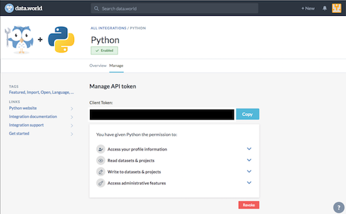

# Octane
A Client-Side Resource Manager written using HTML, CSS, JS, and Python for those who what to finally get some value from their heap of bookmarked/saved resources.

<!-- #  Octane: Bookmark Manager

 -->

---

#### In Progress Tasks
1. Tree view for showing bookmarks within their folders
2. Adding support for collections
3. Server and Frontend Implementation to interact with the data.
    1. Implement Pre-Building of Search Index using node.js for better client performance.
4. Tags Implementation
5. New Implementation of Search using MiniSearch or FlexSearch

# Installation

## Data.World and IFTTT Integration (Optional)
This integration is used to fetch recently bookmarked articles from Medium and add them into local dataset.
> This is currently a temporary measure as the Medium API is too limited for such tasks.

### Setup
First of all, You need to do some manual steps.

#### data.world Account Setup
* You need to make an account on [data.world](https://data.world/)
* Create a dataset, name it what you want.  
Preferably, "Medium Bookmarks" with stream "medium-bookmarks".

#### IFTTT Account Setup
* Go to [IFTTT](https://ifttt.com/) and make an account
* Activate this applet for your account: [Store Medium bookmarks in a data.world dataset](https://ifttt.com/applets/NNVn2wqv-store-medium-bookmarks-in-a-data-world-dataset)  
&nbsp;&nbsp;&nbsp;&nbsp; Note: This is the official applet made by data.world, not made by me.
* Select the relevant `Dataset` and `Stream`

Your Medium now should be connected to data.world through IFTTT. Now, if you add a bookmark in Medium,
it should show up as a `*.jsonl` file in your dataset.

#### Setup your data.world Python Integration
* Open the "**Workplace**" on the dataset
* Find the integrations menu on the top right, click on "**Add More Integrations**"
    - Having Trouble? Use this link: [Python Integration](https://data.world/integrations/python)
* Enable the `python` integration
* Go over to the "**Manage**" tab
* Copy your API Client Token, you'll need it to configure the python Library provided by dataworld. The page should look like the following (As of 06/2019):   

#### Install the [data.world-py library](https://github.com/datadotworld/data.world-py)
* Run `pip3 install "datadotworld[pandas]"` on your terminal ("" are only required if you are using zsh shell rather than bash shell)
* Now, you need to configure the library to use **your** dataworld dataset using the API client Token
    - You can either run `dw configure` on your terminal and paste the API Token
    - Alternatively, tokens can be provided via the DW_AUTH_TOKEN environment variable. On MacOS or Unix machines, run (replacing \<YOUR_TOKEN> below with the token obtained earlier):  
    `export DW_AUTH_TOKEN=<YOUR_TOKEN>`

# Concepts used
* [Object-relational mapping](https://stackoverflow.com/a/1152323/7800641) to add flexibility in the data handling.

---
Icon used: <a href="https://icons8.com/icon/44780/book-shelf">Book Shelf icon by Icons8</a>
